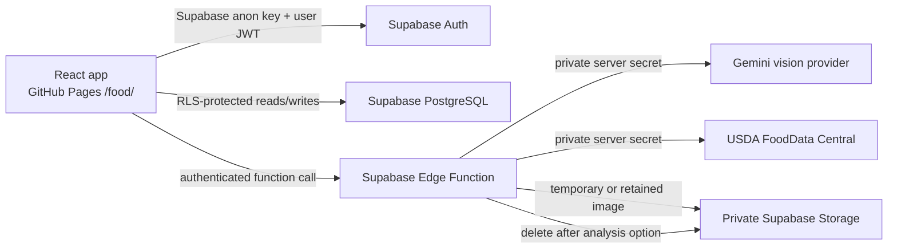

# Plateful food tracker

Plateful is a mobile-first meal journal at `https://armutie.github.io/food/`. A user photographs a meal, optionally includes a known size reference, reviews a structured AI estimate, corrects every food and nutrient value, and saves the result to a private account.

Nutrition values are estimates, not measurements or medical advice. The user must review results before relying on them.

## 1. Product overview

The guided flow supports camera capture or file upload, browser-side image preparation, reference-object context, AI analysis, high-value follow-up questions, USDA nutrition matches, editable serving weights, manual nutrient overrides, daily totals, history, and meal detail.

Demo mode exercises the complete interface without external credentials. It is never selected as a fallback: `VITE_DEMO_MODE=true` must be set explicitly.

## 2. Architecture



GitHub Pages hosts only static frontend files. Supabase persists authentication, meals, and optional images while the developer laptop is off. Provider keys exist only in the Edge Function environment.

The browser uses service interfaces for vision, nutrition, authentication, and meal persistence. Demo and production implementations share these contracts. The Edge Function has separate `MealVisionProvider` and `NutritionProvider` interfaces, so a Muse Spark 1.1, Grok 4.5, regional nutrition, or commercial provider can be added without changing UI or database records.

## 3. Local development

Requirements: Node.js 22+, npm, and optionally the Supabase CLI.

```powershell
npm install
Copy-Item .env.example food-app/.env.local
```

For the credential-free demo, keep only:

```env
VITE_DEMO_MODE=true
```

Run:

```powershell
npm run dev:food
```

Open `http://127.0.0.1:4173/food/`. Vite uses `/food/` as its base even locally. App navigation uses hash routes, so refreshing `#/history` or `#/meal/...` does not require a GitHub Pages fallback.

## 4. Environment variables

Frontend variables are public:

| Variable | Purpose |
| --- | --- |
| `VITE_DEMO_MODE` | Explicit `true` or `false`. Never inferred from missing credentials. |
| `VITE_SUPABASE_URL` | Supabase project URL. Required when demo mode is false. |
| `VITE_SUPABASE_ANON_KEY` | Public Supabase anon/publishable key. RLS still enforces access. |

Edge Function secrets are private:

| Variable | Purpose |
| --- | --- |
| `VISION_PROVIDER` | `gemini` |
| `VISION_MODEL` | Defaults to `gemini-3.6-flash` |
| `GEMINI_API_KEY` | Gemini provider key |
| `NUTRITION_PROVIDER` | `usda` |
| `USDA_API_KEY` | FoodData Central key |
| `SUPABASE_URL` | Supabase project URL |
| `SUPABASE_ANON_KEY` | Used to validate the caller JWT |
| `SUPABASE_SERVICE_ROLE_KEY` | Used only inside the function for controlled image cleanup |
| `ALLOWED_ORIGINS` | Comma-separated origins, normally local Vite and `https://armutie.github.io` |

Never prefix provider or service-role secrets with `VITE_`.

## 5. Supabase project setup

1. Create a Supabase project.
2. Install and authenticate the Supabase CLI.
3. From the repository root, link the project:

```powershell
supabase login
supabase link --project-ref YOUR_PROJECT_REF
```

## 6. Database migration

Apply [`supabase/migrations/202607270001_food_tracker.sql`](../supabase/migrations/202607270001_food_tracker.sql):

```powershell
supabase db push
```

The migration creates normalized profiles, meals, and meal items; original and corrected values are separate JSON/columns. It also creates the profile trigger, update timestamps, idempotency constraint, indexes, RLS, and storage policies.

## 7. Authentication configuration

In Supabase Authentication:

1. Enable email OTP or magic-link sign-in.
2. Set Site URL to `https://armutie.github.io/food/`.
3. Add redirect URLs:
   - `https://armutie.github.io/food/`
   - `http://127.0.0.1:4173/food/`
4. Customize the email template if desired.

Unauthenticated users only see sign-in. RLS filters profiles, meals, meal items, and storage objects by `auth.uid()`.

## 8. Storage configuration

The migration creates a private `meal-images` bucket with a 5 MB object limit and JPEG/PNG/WebP content types. Object paths start with the authenticated user ID, and storage policies enforce that ownership.

The browser compresses large images to a maximum 2048-pixel edge and approximately 2.5 MB, normalizes orientation through browser decoding, converts to JPEG, and drops irrelevant metadata. HEIC/HEIF decoding depends on browser support; the UI gives a conversion error when decoding is unavailable.

For **Delete after analysis**, the Edge Function uploads the image for analysis and then calls Storage removal after successful analysis. It returns no image path. On provider failure, it also attempts cleanup.

## 9. Gemini API setup

Create a Gemini API key with access to the configured model. Set:

```env
VISION_PROVIDER=gemini
VISION_MODEL=gemini-3.6-flash
GEMINI_API_KEY=...
```

Google documents `gemini-3.6-flash` as a stable image-input model with structured-output support. The provider requests `application/json` with an explicit JSON Schema. The Edge Function parses the JSON and validates it again with Zod. Plain prose is never treated as a result. If account or regional access differs, set `VISION_MODEL` to an available structured-output-capable Gemini model; no frontend change is required.

The prompt explicitly prohibits claims about invisible oil, butter, sugar, cream, fillings, food depth, internal density, hidden food, or exact quantities.

Provider references: [Gemini 3.6 Flash model](https://ai.google.dev/gemini-api/docs/models/gemini-3.6-flash) and [structured output](https://ai.google.dev/gemini-api/docs/structured-output).

## 10. USDA FoodData Central setup

Request a FoodData Central API key and set:

```env
NUTRITION_PROVIDER=usda
USDA_API_KEY=...
```

For each identified food, the function searches Foundation, SR Legacy, and FNDDS records. Nutrients per 100 g come from USDA; the app calculates the serving values deterministically. Ambiguous mixed dishes are marked uncertain, and users can choose another match or enter nutrients manually. Source and FDC record IDs are stored.

API reference: [USDA FoodData Central API Guide](https://fdc.nal.usda.gov/api-guide/).

## 11. Edge Function deployment

Set secrets without putting them in Git:

```powershell
supabase secrets set VISION_PROVIDER=gemini VISION_MODEL=gemini-3.6-flash
supabase secrets set GEMINI_API_KEY=YOUR_KEY NUTRITION_PROVIDER=usda USDA_API_KEY=YOUR_KEY
supabase secrets set ALLOWED_ORIGINS=http://127.0.0.1:4173,https://armutie.github.io
```

Supabase provides `SUPABASE_URL`, `SUPABASE_ANON_KEY`, and `SUPABASE_SERVICE_ROLE_KEY` to hosted functions. Deploy with JWT verification enabled:

```powershell
supabase functions deploy analyze-meal
```

Do not use `--no-verify-jwt`.

Supabase references: [Edge Functions](https://supabase.com/docs/guides/functions), [function authentication](https://supabase.com/docs/guides/functions/auth), and [secret management](https://supabase.com/docs/guides/functions/secrets).

## 12. GitHub Pages deployment

The workflow at `.github/workflows/pages.yml` builds the app into `/food/`, verifies it, then publishes the existing static portfolio and the food tracker together.

1. In GitHub repository settings, open **Pages**.
2. Set **Source** to **GitHub Actions**.
3. Add repository variables:
   - Production: `VITE_DEMO_MODE=false`, `VITE_SUPABASE_URL`, `VITE_SUPABASE_ANON_KEY`.
   - Public demo only: `VITE_DEMO_MODE=true`.
4. Push to `main`, or run the workflow manually.
5. Verify the portfolio root and `https://armutie.github.io/food/`.

The workflow excludes source, secrets, `node_modules`, migrations, and function code from the Pages artifact. No private provider key enters the Vite build.

## 13. Demo mode

Set `VITE_DEMO_MODE=true` before `npm run dev:food` or `npm run build:food`. Demo mode is clearly labelled. It uses the generated sample meal photograph, typed mock analysis and nutrition data, editable review, localStorage persistence, history, and idempotent saves.

Clear `plateful-demo-*` keys in browser localStorage to reset demo data.

## 14. Testing

```powershell
npm run typecheck:food
npm run lint:food
npm run test:food
npm run test:e2e:food
npm run build:food
npm run verify:food
```

Tests cover structured analysis validation, nutrient scaling, daily totals, time-zone grouping, original/corrected preservation, reference dimensions, meal validation, provider errors, idempotency, and an integration workflow from mock analysis through editing, save, reload, and daily total.

The end-to-end script owns a local Vite server and Chromium instance, then exercises demo photo selection, analysis, correction, save, detail editing, history, console errors, and overflow checks at 320, 375, 430, and 1280 px. Install the browser once with `npx playwright install chromium`.

The Edge Function can be checked in a Deno environment with:

```powershell
deno check supabase/functions/analyze-meal/index.ts
```

## 15. Security notes

- RLS is the authorization boundary; client checks are only user experience.
- The anon key is public by design. The service-role, Gemini, and USDA keys are server-only.
- The function validates authentication, origin, request size, MIME/data agreement, provider output, and timeouts.
- Logs include error categories and provider status, not images, secrets, raw tokens, or full sensitive payloads.
- Meal creation uses a per-attempt UUID and a unique `(user_id, client_request_id)` constraint to avoid duplicate saves.
- The image bucket is private; signed display URLs are short-lived.
- Rotate any secret that is accidentally committed, even if the Git history is later rewritten.

## 16. Known limitations

- Photograph-based portion estimates remain approximate. A visible object improves scale but cannot guarantee volume or nutrient accuracy.
- HEIC/HEIF preprocessing varies by browser and operating system.
- A single view cannot recover hidden food, depth, density, or invisible ingredients.
- The first USDA result is proposed automatically; mixed dishes often require user selection or manual entry.
- Follow-up answers inform the user’s correction pass but do not automatically rerun the provider in this version.
- The app does not reconstruct recipes, diagnose conditions, or provide dietary advice.

## 17. Future provider integration

Implement `MealVisionProvider` or `NutritionProvider` in `supabase/functions/analyze-meal/providers.ts`, add the provider to the relevant factory, and select it with `VISION_PROVIDER` or `NUTRITION_PROVIDER`. Keep provider-specific payloads inside the adapter and return the existing versioned domain shape. Muse Spark 1.1 or Grok 4.5 can therefore be added without changing React forms, meal storage, or nutrient calculations.
